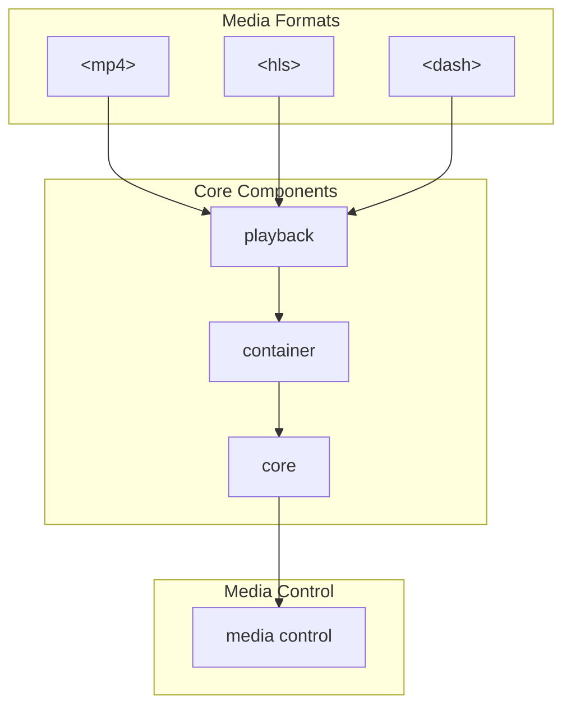
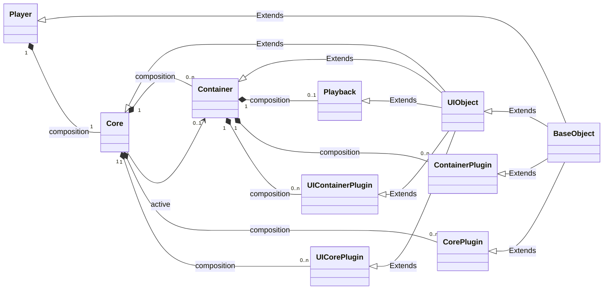
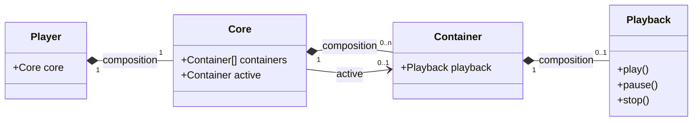
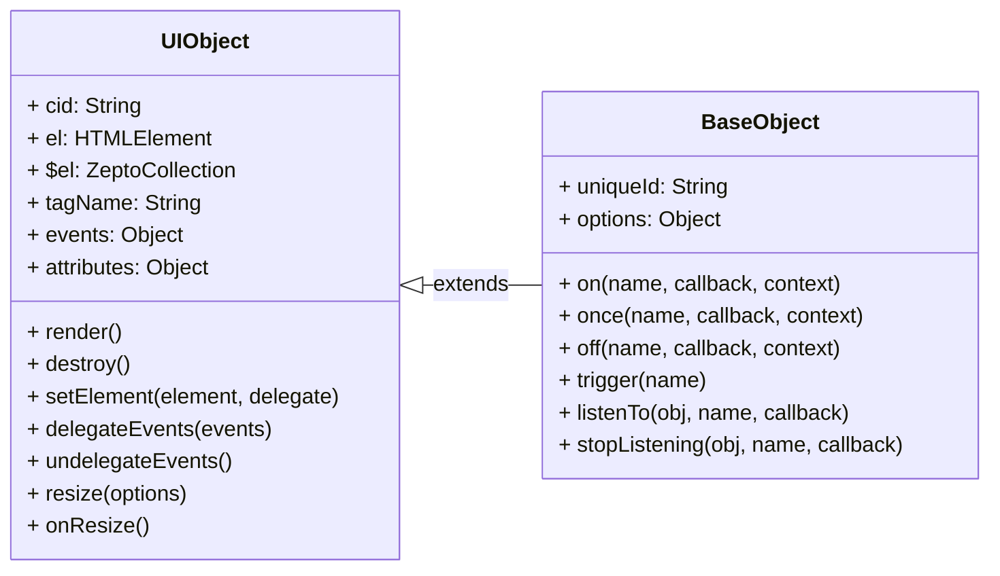
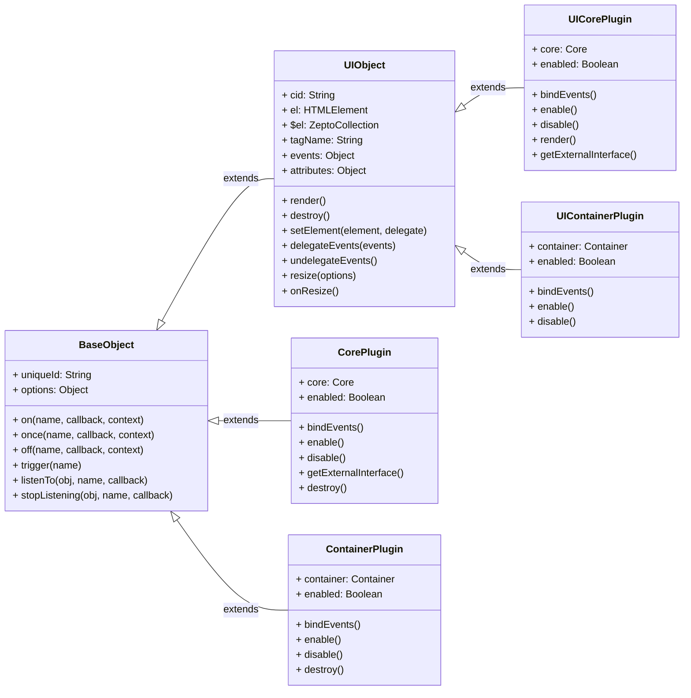
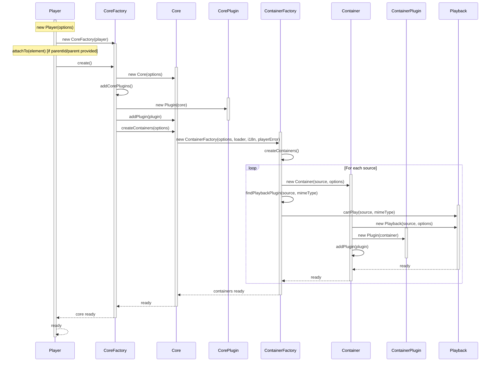

# Architecture

Clappr is an extensible, open-source, plugin-oriented, HTML5-first media player for web applications. It was designed around these main components:  

* [Player](https://github.com/clappr/clappr/blob/main/packages/clappr-core/src/components/player/player.js): Clappr's Public API and entry point for clients.
* [Core](https://github.com/clappr/clappr/blob/main/packages/clappr-core/src/components/core/core.js): The Player's Core. Almost all components are created and managed here. The Player usually communicates with other components through the Core.
* [MediaControl](https://github.com/clappr/clappr/blob/main/packages/clappr-plugins/src/plugins/media_control/media_control.js): The Media Control is the UI interface so the user can interact with the Player's Playback. It should work with any Playback (MP4, hls.js, shaka-player, etc.)
* [Container](https://github.com/clappr/clappr/blob/main/packages/clappr-core/src/components/container/container.js): A wrapper around the Playback. It can be seen as just a delegator, but it's also used to build plugins that are agnostic of the Playback's kind.
* [Playback](https://github.com/clappr/clappr/blob/main/packages/clappr-core/src/base/playback/playback.js): An abstraction that actually plays the media. It might use: [`<video>` tag](https://developer.mozilla.org/en-US/docs/Web/HTML/Element/video).

## Media Format and Component Architecture

## Architecture

Component | Role | Related Components
-- | -- | --
Player | Entry point and public API of Clappr. Manages the Player's top-level state. | `Core`
Core | Manages the Player's main components: containers, plugins, etc. | `CorePlugin`, `UICorePlugin`, `Container`
Container | Wraps a `Playback` instance and manages `Container`-level plugins. | `ContainerPlugin`, `UIContainerPlugin`, `Playback`
Playback | Abstraction layer that controls the actual media element or wrapper (hls.js, dash-shaka-playback, html5, `<video>` tag, etc). | –
MediaControl | `UICorePlugin` that provides the UI controls for playback (play/pause, seek, volume, etc.). | –

---

## Media Format and Component Architecture

Plugin Type | Description | Example Use
-- | -- | --
CorePlugin | Has access to all components of the Player. Typically used for features that need a global view or to collect information. | User statistics tracking
UICorePlugin | Same as `CorePlugin`, but can also render UI elements. | [Chromecast integration](https://github.com/clappr/clappr-chromecast-plugin), [thumbnails](https://github.com/tjenkinson/clappr-thumbnails-plugin)
ContainerPlugin | Interacts with the `Playback` layer, allowing you to control or modify playback behavior. | [Speech control](https://github.com/clappr/clappr-speech-control-plugin)
UIContainerPlugin | Same as `ContainerPlugin`, but can also render UI elements. | [Watermark overlay](https://github.com/clappr/watermark)
Playback | A module that defines how the Player handles specific playback types. | [360-degrees playback](https://github.com/thiagopnts/video-360), [Shaka Player integration](https://github.com/clappr/dash-shaka-playback).
MediaControl | Provides and manages the Player's main control interface (buttons, timeline, volume, etc.) | Default player UI

**You can create plugins around these abstractions. Here's the kinds of available plugins:**

* **CorePlugin**: Accesses all the components of the Player (Ex: Getting User Statistics).
* **UICorePlugin** - Same as **CorePlugin**, but it's able to render UI elements. (Ex.: [Chromecast](https://github.com/clappr/clappr-chromecast-plugin) and [Thumbnails](https://github.com/tjenkinson/clappr-thumbnails-plugin) plugins)
* **ContainerPlugin**: Accesses Playback info and is able to control it or change its behavior (Ex.: [Speech Control](https://github.com/clappr/clappr-speech-control-plugin) plugin).
* **UIContainerPlugin**: Same as **ContainerPlugin**, but it's able to render UI elements. (Ex.: [Watermark](https://github.com/clappr/watermark) plugin).
* **Playback**: Although more of module than a plugin, you can provide a Playback for the Player (Ex.: [360-degrees playback](https://github.com/thiagopnts/video-360), [shaka-player playback](https://github.com/clappr/dash-shaka-playback)).
* **MediaControl**: Provides controls to the Player.

## Clappr Objective

 * **Keep extensibility open:** You can create an entire plugin in a different repository, you can disable it, you can create a new playback that is able to work with the old media control and existent plugins.
 * **Use mainly events to communicate with components:** which makes your program less coupling in your plugin level... you don't need to call a function, you can listen to events and trigger events.
 * **Have a minimal footprint:** You can add the plugins you need, for instance you don't need to load [Chromecast](https://github.com/clappr/clappr-chromecast-plugin) when you don't need it.

 ## Main Project Hierarchical Structure

## Main Classes

### We favor event based components communication, both internally as well as for external interface. Thus all Clappr classes shall be derived from the BaseObject classes:

## Clappr is Plugin Oriented

## Main Project Hierarchical Structure

## Clappr Initialization Sequence

