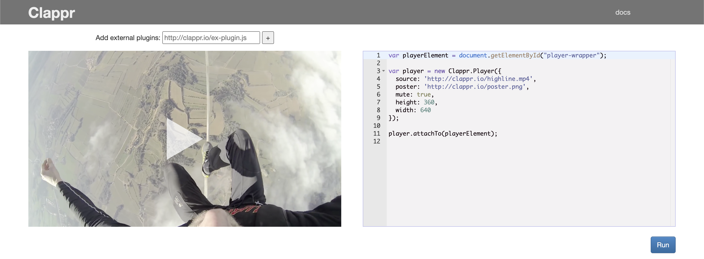

# Playground

You can test Clappr directly through your browser via https://clappr.io/demo.

## Features

* **Shareable:** Clappr's Playground allows you to share the current configuration via a link generated by the application. To do so, you must use the **Run** button. After that, the site's URL will be updated into a shareable link with a hashcode.
* **External Plugins:** Alongside testing Clappr's stable version, you're able to test out the addition of external plugins by adding a link to the plugin's JavaScript file.